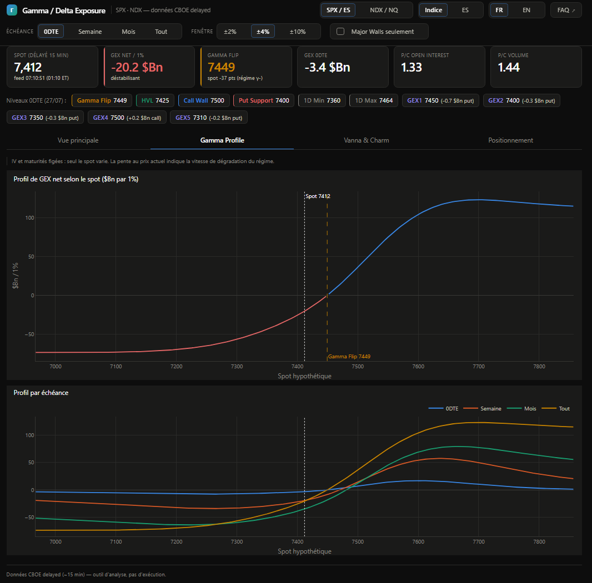
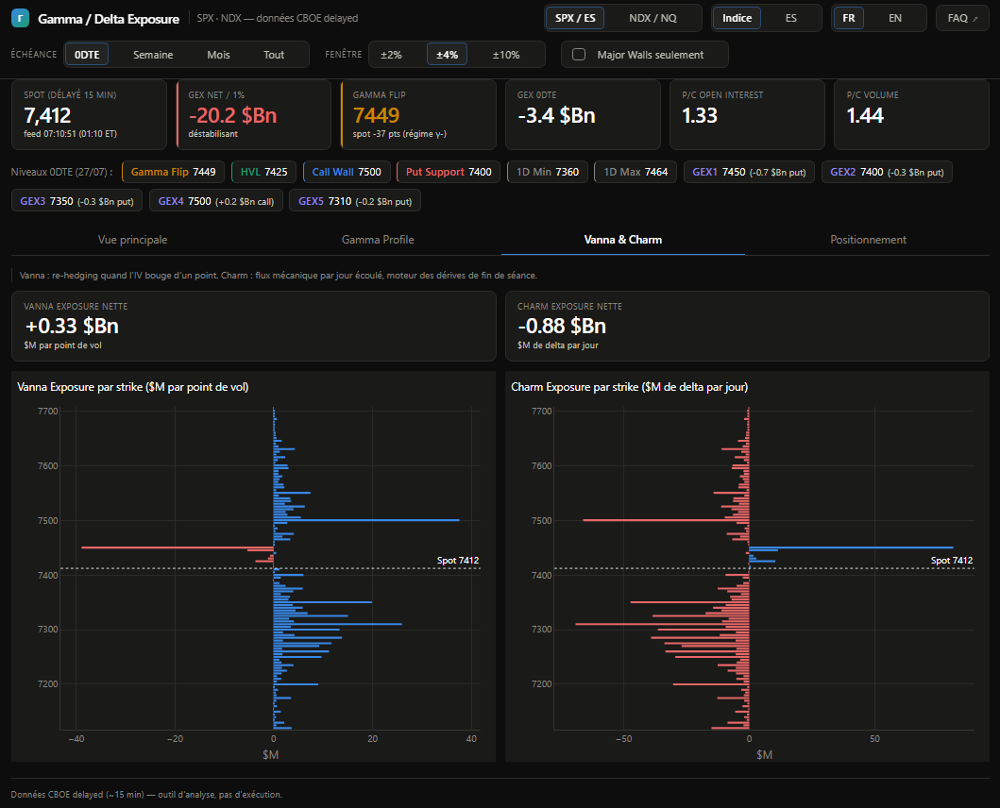
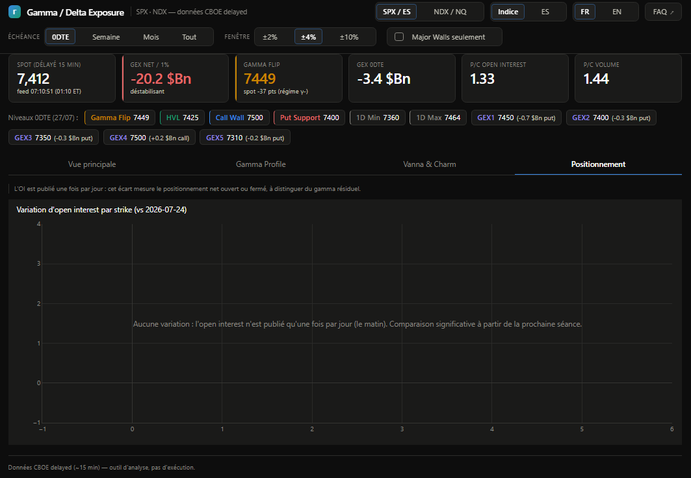

# GEX Dashboard — Gamma/Delta Exposure analytics (SPX/ES, NDX/NQ)

*[Version française](README.md)* · *[FAQ](FAQ.en.md)* · *[Disclaimer](DISCLAIMER.md)*

[MIT License](LICENSE) — **analysis tool only**: no trading, no execution,
no investment advice. Every instance pulls its own data from CBOE's public
delayed endpoint; this project redistributes no market data.

> ⚠️ **Trading options and derivatives involves a high risk of loss.**
> This tool is provided for educational purposes, without warranty, and does
> not constitute investment advice. Read the [full disclaimer](DISCLAIMER.md)
> before using it.

## Screenshots

| Main view | Gamma Profile |
|---|---|
|  |  |
| GEX/DEX by strike, 0DTE levels, delta flow, history | Net GEX profile vs spot, broken down by expiration |

| Vanna & Charm | Positioning |
|---|---|
|  |  |
| Second-order Greeks by strike | Open interest change between sessions |

A free, self-hosted alternative in the spirit of SpotGamma: rebuild the
market structure metrics that options dealers' hedging creates — Gamma
Exposure by strike, Gamma Flip (zero gamma), Call/Put Walls, delta flow.

## Data source

CBOE public delayed endpoint (undocumented):
`https://cdn.cboe.com/api/global/delayed_quotes/options/_SPX.json`
(indices prefixed with `_`). One GET returns the full chain — bid/ask, IV,
open interest, volume, Greeks — plus spot. **~15 min delayed**, regenerated
~every 60 s (feed timestamps are UTC). Default underlyings: SPX and NDX;
SPY/QQQ available as fallbacks (`gex/config.py`).

## Quick start

```
python -m venv .venv
.venv/bin/pip install -r requirements.txt        # Windows: .venv\Scripts\pip
.venv/bin/python run.py                          # dashboard on http://127.0.0.1:8050
```

Tests: `.venv/bin/python -m pytest tests/`

## Features

- GEX / DEX by strike (±2/4/10 % window), calls/puts breakdown on hover
- 0DTE levels: **Call Wall / Put Wall / GEX3-5** (top gamma strikes),
  **Gamma Flip** (OI-weighted zero gamma), **HVL** (volume-weighted flip)
- Net GEX, P/C ratios, IV skew by expiration, expiry buckets (0DTE/week/month)
- 1-min delta flow (Δvolume×δ proxy) with session picker
- Net GEX & spot-vs-flip history (accumulates automatically while running)
- Optional historical backfill via Databento (`gex/backfill.py`, paid,
  cost quote shown before any download)
- MCP server (`gex/mcp_server.py`) to query the data from Claude
- FR/EN interface (browser language auto-detected, manual toggle remembered)

## Computation conventions

- **GEX** ($ per 1 % move) = γ × OI × 100 × spot² × 0.01 — calls positive,
  puts negative (SpotGamma's "naive" convention: dealers long calls, short puts).
- **Gamma Flip**: net GEX profile recomputed over a ±8 % spot grid (IV and
  maturities frozen), zero crossing nearest to spot interpolated.
- **Delta flow** (proxy) = Δvolume between pulls × δ × 100 × spot. Taker
  direction is not observable in this feed: delta-weighted pressure, not
  true signed order flow.
- Expiries set at 16:00 ET; expired contracts excluded; 0DTE kept intraday
  with a 5-minute floor on t.

## Known limits

- 15-min delayed data — structure-reading tool, not an execution tool.
- The CBOE endpoint is not contractual: format may change (ingestion is
  isolated so another source, e.g. Tradier, can be plugged in).
- Levels are in index points (SPX/NDX), not converted to ES/NQ futures.
