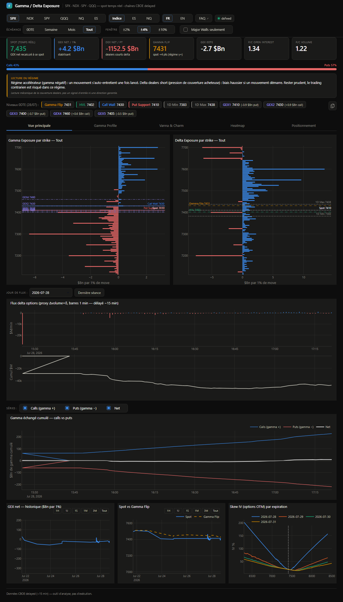

# Onglet 1 — Vue principale

*[← Retour au sommaire](README.md)*

C'est l'onglet qui s'ouvre par défaut : la vue d'ensemble du jour, avec tout ce qu'il faut pour évaluer la structure du marché d'un coup d'œil.

## En haut : le résumé du jour

Les tuiles, la jauge Calls/Puts, le cadre "Lecture du régime" et la bande de niveaux sont **communs à tous les onglets** — ils restent affichés en permanence, quel que soit l'onglet ouvert en dessous. Chaque chiffre y est expliqué en détail dans [comprendre-les-chiffres.md](comprendre-les-chiffres.md).

## Les deux graphiques principaux

**Gamma Exposure par strike** (à gauche) et **Delta Exposure par strike** (à droite) montrent le GEX et le DEX (voir le doc sur les chiffres si ces termes ne te disent rien), mais **répartis par prix d'exercice** (strike) plutôt qu'en un seul total.

- Chaque barre horizontale correspond à un strike.
- **Bleu** = valeur positive à ce strike, **rouge** = négative.
- Les lignes pointillées superposées (Call Wall, Put Support, Gamma Flip, Spot...) permettent de voir tout de suite où se trouve le prix actuel par rapport aux murs.

C'est le graphique le plus dense de tout le dashboard : il montre en un coup d'œil quels strikes concentrent le plus de gamma (donc de couverture potentielle des dealers).

## Le flux delta options

Un graphique en deux parties qui montre, minute par minute, **ce qui se négocie réellement aujourd'hui** (pas les positions déjà installées) :

- En haut, des barres bleues/rouges : le flux net par minute (en millions de dollars).
- En bas, une courbe blanche : le **cumul** de ce flux depuis l'ouverture — utile pour voir la tendance de fond de la séance plutôt que le bruit minute par minute.

⚠️ Le sens acheteur/vendeur réel n'est pas observable dans la donnée publique CBOE : c'est une estimation (delta × variation de volume), pas un vrai flux signé comme le ferait un flux d'ordres professionnel.

## Gamma échangé cumulé — calls vs puts

Le même principe que le flux delta, mais pour le **gamma** plutôt que le delta, et séparé entre calls et puts (plus une courbe "Net"). Une case à cocher au-dessus permet de n'afficher que les séries qui t'intéressent. Un décrochage entre la courbe calls et la courbe puts indique de quel côté le marché "se charge" en gamma pendant la séance.

## Les trois petits graphiques du bas

- **GEX net — historique** : l'évolution du GEX net dans le temps (boutons 1H/1J/1S/1M/3M/Tout pour zoomer).
- **Spot vs Gamma Flip** : superpose le prix réel et le Gamma Flip dans le temps — les croisements entre les deux courbes marquent les changements de régime (γ+ ↔ γ-).
- **Skew IV** : la volatilité implicite par strike, pour chaque échéance proche (une courbe par date) — voir [comprendre-les-chiffres.md](comprendre-les-chiffres.md) pour ce que ça représente.

---

*[← Retour au sommaire](README.md) · [Onglet suivant : Gamma Profile →](2-gamma-profile.md)*
