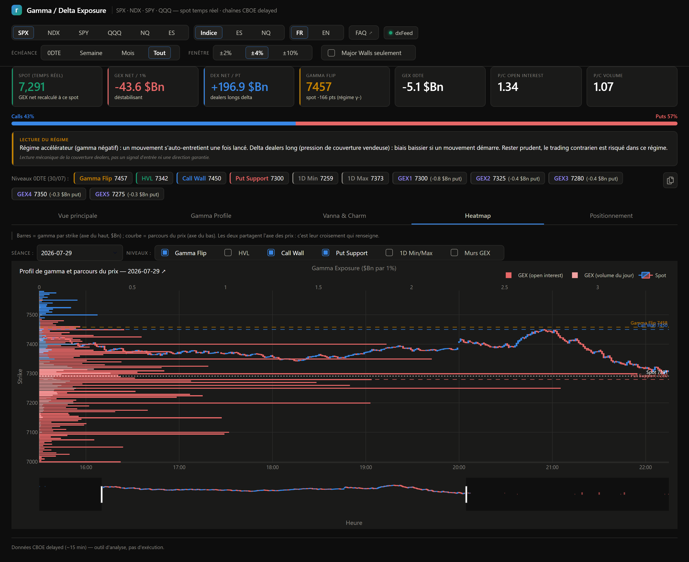

# Onglet 4 — Heatmap

*[← Retour au sommaire](README.md)*

L'onglet le plus visuel : il superpose **le prix réel** et **la structure de gamma** sur le même axe vertical, pour voir directement si le marché évolue au contact d'une concentration de gamma ou à distance.

## Les deux commandes du haut

- **Séance** : choisit le jour à afficher (les jours disponibles sont ceux où au moins une chaîne d'options a été enregistrée).
- **Niveaux** : une liste à cocher pour choisir quelles lignes horizontales afficher (Gamma Flip, HVL, Call Wall, Put Support, 1D Min/Max, Murs GEX) — décoche celles qui ne t'intéressent pas pour alléger le graphique.

## Le graphique

- **Les bougies** : le parcours réel du prix minute par minute, une vraie bougie japonaise (ouverture/haut/bas/clôture) si le flux temps réel (compte courtier) est actif. Sans lui, seuls les points de chaque pull CBOE sont disponibles (moins précis). Le graphique se met à jour tout seul, en continu, sans perdre ton zoom.
- **Les barres horizontales** sur le bord droit : le gamma par strike, à la hauteur de son prix, comme l'indicateur « Σ Profil gamma » de la page scalp. **Vert** = strike net call, **rouge** = strike net put, longueur = poids. Deux pondérations superposées : la barre épaisse et pâle utilise l'*open interest* (les positions déjà installées), la barre fine et vive le *volume du jour* (ce qui se traite maintenant). Un strike fin en OI mais épais en volume est un niveau qui **prend de l'importance en cours de séance**, alors qu'il n'existait pas la veille.

C'est le croisement des deux qui compte : si le prix arrive au niveau d'une grosse barre de gamma, c'est le signal à surveiller.

💡 Si tu regardes un indice (SPX, NDX...) mais que le sélecteur d'échelle en haut de page est réglé sur "ES" ou "NQ", les bougies affichent le **vrai** historique du future correspondant plutôt qu'une conversion approximative du prix de l'indice.

---

*[← Retour au sommaire](README.md) · [← Vanna & Charm](3-vanna-charm.md) · [Onglet suivant : Positionnement →](5-positionnement.md)*
