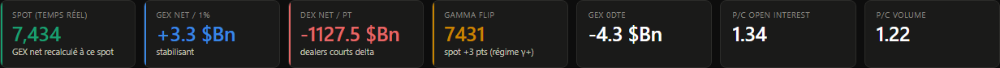
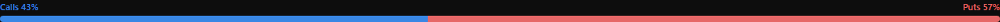
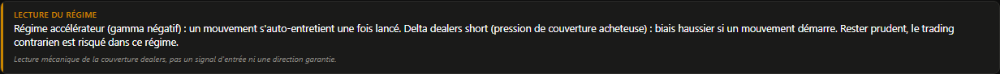
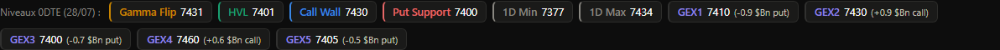

# Comprendre les chiffres du dashboard

*[← Retour au sommaire](README.md)*

Ce document explique **chaque chiffre** que tu peux voir sur le dashboard, un par un, en partant de zéro. Pas besoin de connaître les options pour le lire — chaque terme un peu technique est expliqué la première fois qu'il apparaît.

Si tu veux plutôt comprendre un **onglet** dans son ensemble (les graphiques), regarde les fichiers `1-vue-principale.md` à `5-positionnement.md`. Ici, on ne parle que des **nombres**.

---

## D'abord, deux notions qui reviennent partout : GEX et DEX

Le dashboard repose sur une idée simple : quand un trader achète une **option** (le droit d'acheter ou de vendre une action à un prix fixé à l'avance), quelqu'un doit la lui vendre. Ce vendeur, c'est en général un **dealer** — une banque ou une société qui fait le marché sur les options. Pour ne pas prendre de risque, ce dealer **se couvre** : il achète ou vend l'action elle-même, en continu, pour compenser sa position sur l'option.

- **GEX (Gamma Exposure)** : mesure **combien** le dealer doit acheter/vendre à chaque mouvement du prix, et **dans quel sens** ça agit sur le marché.
  - GEX **positif** → les dealers achètent quand le prix baisse et vendent quand il monte. Ça **freine** les mouvements (comme un amortisseur).
  - GEX **négatif** → l'inverse : les dealers vendent quand le prix baisse et achètent quand il monte. Ça **amplifie** les mouvements (comme si l'amortisseur était cassé).

- **DEX (Delta Exposure)** : mesure **dans quel sens** les dealers sont positionnés *en ce moment*, indépendamment de si le prix bouge.
  - DEX **positif** → les dealers sont structurellement "longs" (ils possèdent déjà plus qu'ils ne doivent) → ils ont tendance à **vendre** pour se rééquilibrer.
  - DEX **négatif** → l'inverse, ils ont tendance à **acheter**.

Retiens juste ceci : **GEX dit comment un mouvement se comporte une fois lancé** (amplifié ou freiné), et **DEX dit dans quel sens les dealers penchent en ce moment**. Ni l'un ni l'autre ne prédit si un mouvement va se produire, ni quand.

⚠️ **Ce ne sont jamais des signaux d'achat/vente.** Ce sont des indices sur la mécanique du marché, pas des prédictions.

---

## Les tuiles du haut

Ces sept cases se recalculent en continu (toutes les 5 secondes) et donnent la photo instantanée de l'indice suivi.

| Tuile | Ce que c'est | Comment le lire |
|---|---|---|
| **Spot (temps réel)** | Le prix actuel de l'indice | Vert = donnée en temps réel (via un compte courtier) ; sinon délayée d'environ 15 minutes (source gratuite CBOE) |
| **GEX net / 1%** | Le GEX total, exprimé en milliards de dollars pour un mouvement de 1% du prix | Positif (souvent affiché en bleu) = "stabilisant" ; négatif (rouge) = "déstabilisant" — voir l'explication du GEX plus haut |
| **DEX net / pt** | Le DEX total, en milliards de dollars par point de prix | Le sous-titre dit directement "dealers longs delta" ou "dealers courts delta" |
| **Gamma Flip** (aussi appelé *Zero Gamma*) | Le prix auquel le GEX net passerait de positif à négatif (ou l'inverse) | Si le spot est en dessous du Gamma Flip, on est en régime négatif (γ-) ; au-dessus, en régime positif (γ+) — c'est marqué juste en dessous du chiffre |
| **GEX 0DTE** | Le GEX net, mais compté uniquement sur les options qui expirent **aujourd'hui** ("0 Days To Expiration") | Ces options-là bougent le plus vite ; leur GEX peut différer beaucoup du GEX net global |
| **P/C Open Interest** | Le ratio **Puts / Calls** sur les positions ouvertes (open interest = nombre de contrats détenus, pas encore clôturés) | Au-dessus de 1 → il y a plus de puts (options qui parient sur la baisse ou protègent contre elle) que de calls en position ouverte |
| **P/C Volume** | Le même ratio, mais sur ce qui s'est **échangé aujourd'hui** (le volume), pas sur les positions installées | Un P/C Volume très différent du P/C Open Interest peut signaler un changement de sentiment en cours de séance |

---

## La jauge Calls vs Puts

Une version **visuelle** du P/C Open Interest ci-dessus : la barre bleue à gauche représente la part des calls, la barre rouge à droite la part des puts, en pourcentage du total des positions ouvertes. Plus une couleur prend de place, plus ce côté domine. C'est exactement la même donnée que la tuile "P/C Open Interest" — juste plus rapide à lire d'un coup d'œil.

---

## Le cadre "Lecture du régime"

Ce cadre traduit en phrase les deux notions du début (GEX et DEX) combinées. Il change de couleur selon l'intensité :

- **Bordure verte** : régime freiné (GEX positif) — range probable.
- **Bordure ambre** : régime accélérateur modéré (GEX négatif).
- **Bordure rouge** : régime accélérateur **et** delta dealers marqué dans le même sens — les deux mécaniques s'additionnent, c'est la configuration la plus auto-entretenue.

La dernière ligne en italique est un rappel volontairement répété : **ce n'est jamais un signal d'entrée**, seulement une lecture mécanique de ce que les dealers sont obligés de faire.

---

## Les niveaux (murs de gamma)

Cette bande de petites étiquettes liste les prix "importants" du jour, calculés à partir des positions ouvertes sur les options qui expirent le plus vite (l'échéance affichée entre parenthèses, ex. "0DTE (28/07)").

| Niveau | Explication |
|---|---|
| **Gamma Flip** | Le prix où le GEX net change de signe (déjà vu dans les tuiles) |
| **HVL** (*High Volume Level*) | Le même calcul que le Gamma Flip, mais pondéré par le **volume échangé aujourd'hui** plutôt que par les positions déjà installées la veille — utile pour voir si un nouveau niveau prend de l'importance en cours de séance |
| **Call Wall** | Le strike (prix d'exercice) où le GEX des **calls** est le plus fort au-dessus du prix actuel — souvent une résistance, une zone où le marché a tendance à ralentir |
| **Put Support** | Le strike où le GEX des **puts** est le plus fort en dessous du prix actuel — souvent un support |
| **1D Min / 1D Max** | Une estimation statistique de l'amplitude de mouvement attendue sur 1 jour, déduite de la volatilité implicite des options — pas une limite dure, juste un ordre de grandeur |
| **GEX1 à GEX5** | Le classement des 5 strikes ayant le GEX le plus fort en valeur absolue (peu importe le signe), du plus fort (GEX1) au moins fort (GEX5) — chaque étiquette précise si c'est un mur call ou put, et son poids en milliards de dollars |

---

## Les chiffres propres à certains onglets

Ces chiffres n'apparaissent que sur un onglet précis — voir le fichier du tab correspondant pour le contexte complet du graphique associé.

- **Vanna Exposure nette / Charm Exposure nette** (*onglet Vanna & Charm*) : deux grecques de second ordre. La Vanna mesure combien le delta des dealers changerait si la volatilité implicite bougeait d'un point ; la Charm mesure combien de delta est "grignoté" mécaniquement chaque jour qui passe, simplement parce que le temps s'écoule (moteur classique des dérives de fin de séance).
- **Skew IV** (*onglet Vanna & Charm*) : la volatilité implicite (le prix de l'incertitude, en %) selon le strike, pour chaque échéance — en général en forme de "sourire" ou de pente, plus élevée loin du prix actuel.
- **Flux delta options / Gamma échangé cumulé** (*onglet Vue principale*) : pas des positions installées, mais ce qui se **négocie en direct** aujourd'hui, en $M par minute puis cumulé sur la séance.
- **Variation d'open interest** (*onglet Positionnement*) : la différence de positions ouvertes entre la séance d'hier et celle d'aujourd'hui, par strike — l'open interest n'étant publié qu'une fois par jour, ce chiffre ne peut être comparé que d'un jour sur l'autre, jamais en intra-journée.

---

*[← Retour au sommaire](README.md)*
